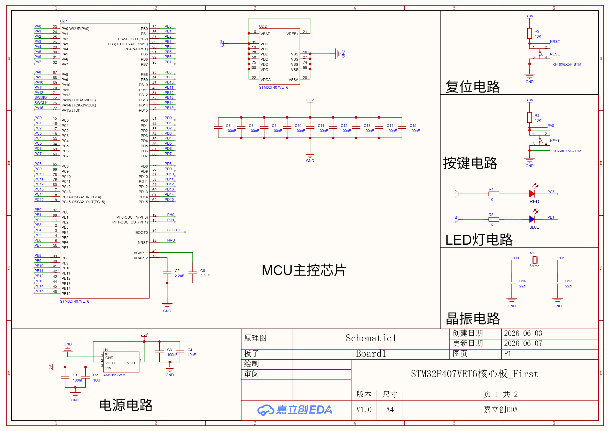
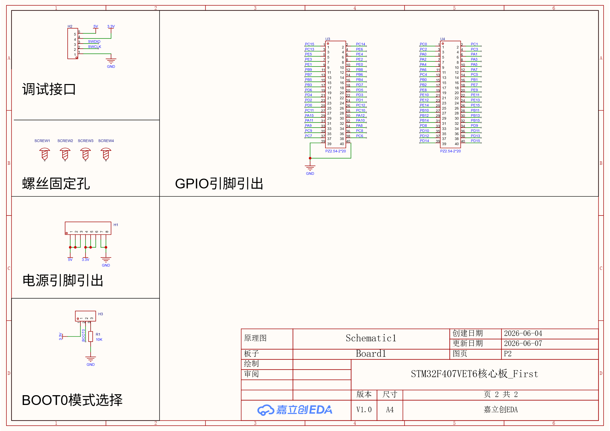
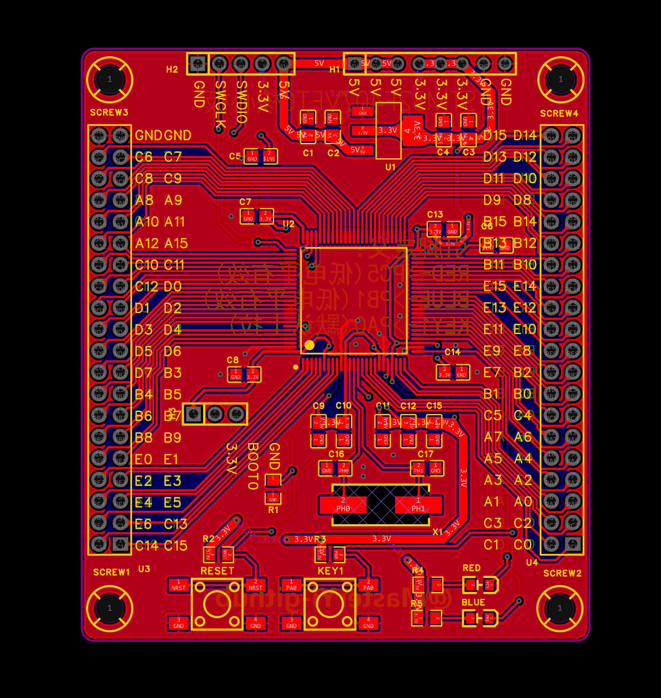
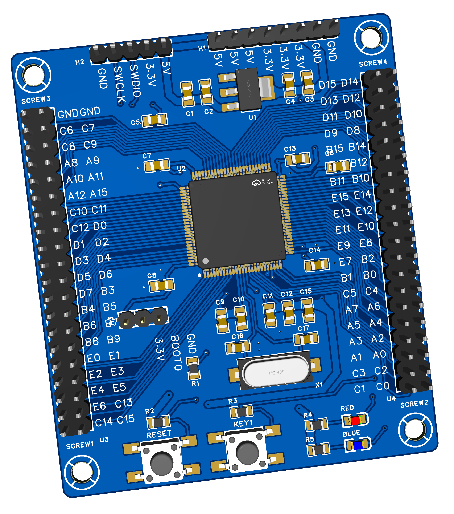
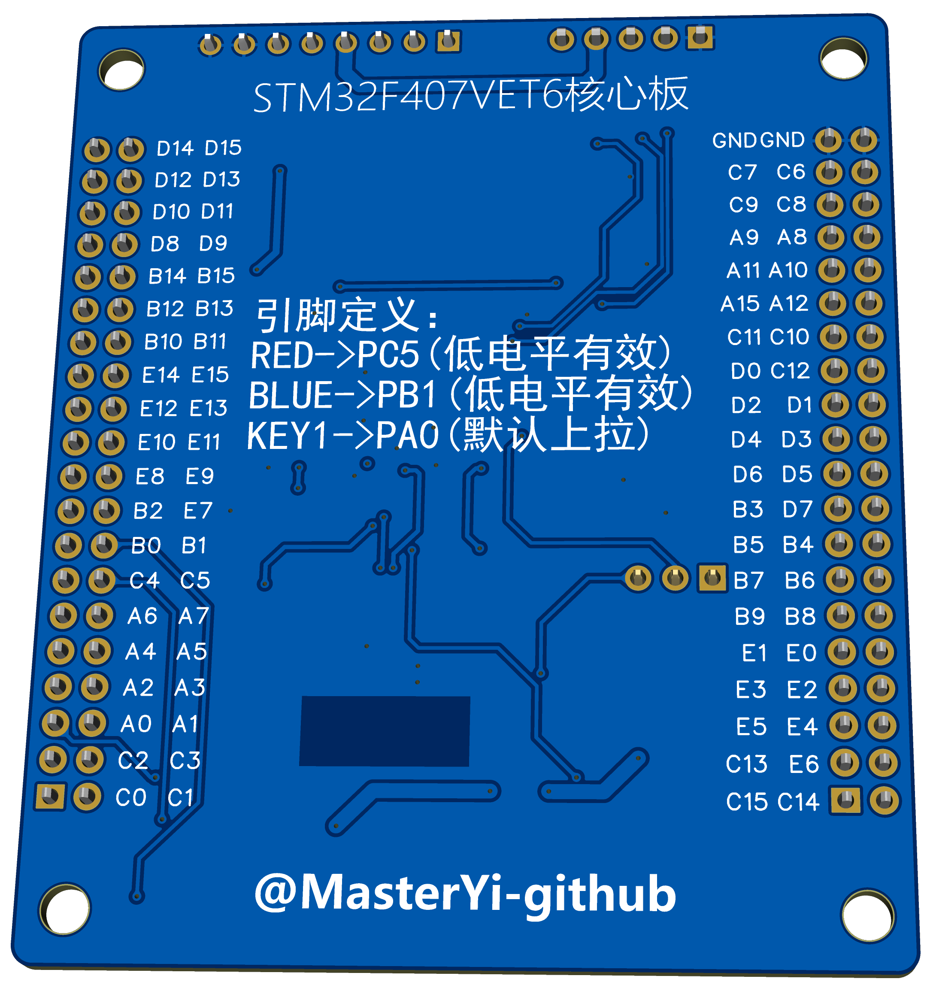

# STM32F407VET6 核心板设计

本项目是基于 STM32F407VET6 的最小系统核心板设计，包含完整的原理图、PCB 设计和生产文件，全程使用嘉立创EDA完成。

---

## 📌 项目简介
这是一次完整的硬件设计实践，目标是制作一块稳定、规范的 STM32F4 系列核心板，重点学习和应用电源完整性、信号完整性等基础 PCB 设计规范。

- 主控芯片：STM32F407VET6
- 板层：2 层板
- 设计工具：嘉立创 EDA
- 核心功能：
  - 3.3V 电源与去耦电路
  - 8MHz 外部晶振电路
  - 复位电路与 BOOT 启动配置电路
  - 全部 GPIO 引脚引出，方便后续扩展
  - 标准 2.54mm 排针接口

---

## 🛠️ 设计亮点与实践
1.  **关键信号处理**
    - 晶振电路严格遵循净空区规则，采用最短、最直、无分支的走线，避免高频干扰
    - 复位与 BOOT 引脚走线短直，上拉/下拉电阻就近放置，减少误触发风险

2.  **电源完整性设计**
    - 3.3V 电源网络采用“主干加粗 + 分支就近”的布线策略，降低压降与干扰
    - 每个去耦电容均靠近芯片引脚放置，并通过过孔直接连接到底层地平面，保证去耦效果

3.  **布线规范**
    - 遵循“先关键信号、后电源、最后铺地”的布线顺序
    - GND 采用整板铺铜，通过大量过孔连接顶层与底层地，构建低阻抗地网络
    - 全程通过 DRC 检查，确保无短路、开路、线宽违规等问题
  
### 原理图

### PCB 布局

### 3D 预览效果

